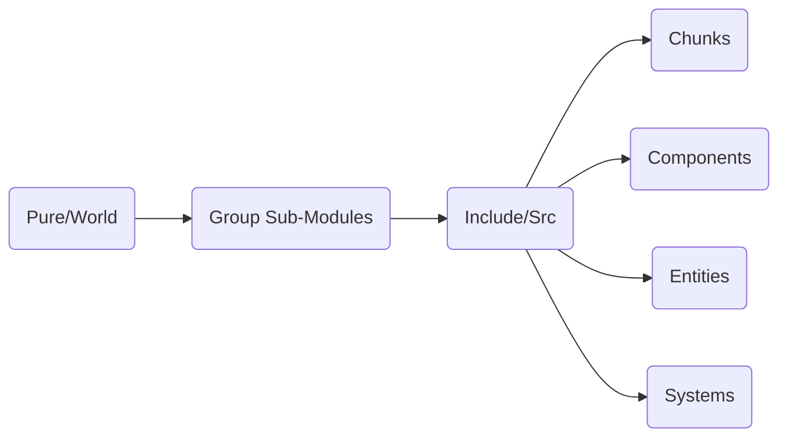
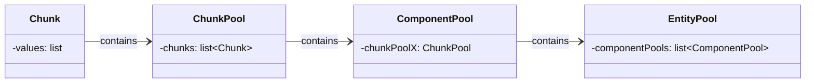
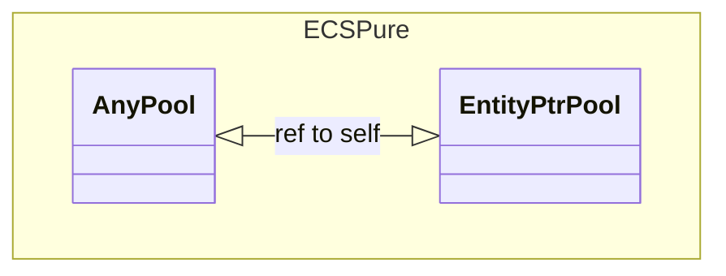
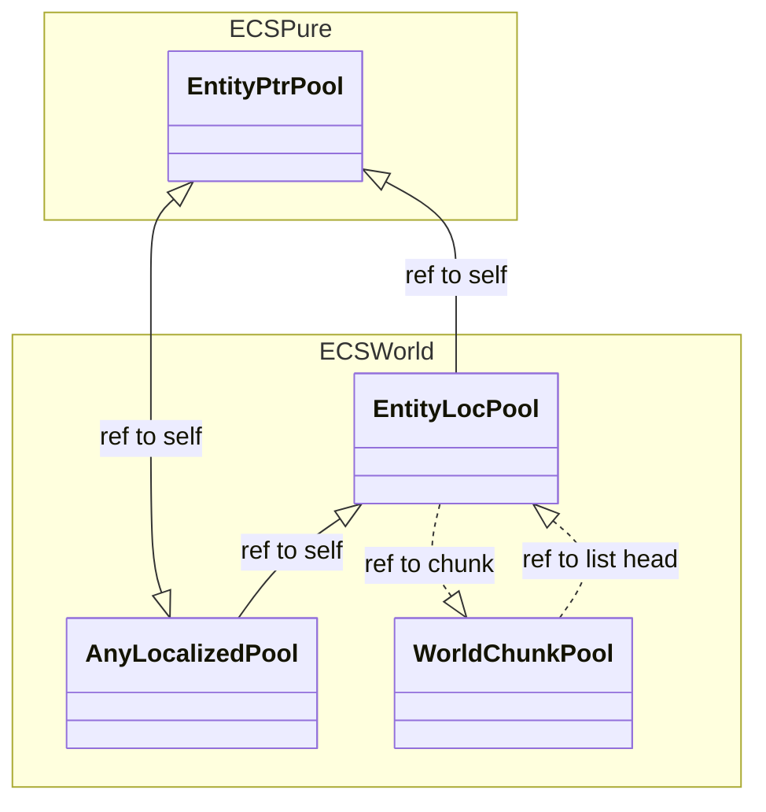

# CPP-ECS
A simple Entity Component System (ECS) written in C++.

## Preface

This is a collection of libs implementing an Entity Component System (ECS) in C++. The goal is to create a simple, and easy to use ECS for development.

The file structure is as follows:

The "pure" ecs is more or less built as follows:

- **Chunks**: A chunk is a collection of components of the same type. It is a contiguous block of memory that stores the components.
- **ChunkPool**: A chunk pool is a collection of chunks. This is the pure form of a memory pool.
- **ComponentPool**: A component pool is a collection of chunk pools. It is usually an abstraction of something, like a position, that wil contain 2 chunk pools, in a 2d context.
- **EntityPool**: An entity pool is a collection of component pools. It is the highest level of abstraction and is used to group components together.
- **Entity**: An entity is a collection of references to components. Direct manipulation of entities is discouraged, as it is better to use the component pools.
- **System**: A system is a function executed on entityPools, allowing for changes in entities' components.

Here is how the entity manager handles the pools and their entities:

And here is how the world manager handles the pools and their entities:
_Note that the WorldChunkPool not being a subclass of AnyLocalizedPool, it uses the above reference system._

